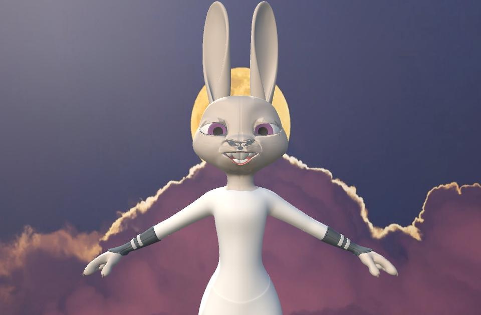

# Face Transfer Application
---
<p align="center"></p>

This is the source code for the final project conducted in the Applied Programming course in the Department of Electrical and Electronic Engineering at Yonsei University. The structure consists of Unity and an application, and you can refer to this repository for the Python server code.

> Unity
> > Asset
> > > image_test.py
> > > ...

Additionally, you can run the Unity project by simply executing the Unity folder. The assets are kept as they are. The Python environment is set up as follows.

---

## Environmental settings

```
  pip install pytorch, tensorflow, cmake, dlib, opencv-python, imutils, socket, FER
```

If you encounter issues installing dlib, please refer to the following link: [Click Here](https://updaun.tistory.com/entry/python-python-37-dlib-install-error)  
The overall structure consists of Python to Unity as the server, and Python to Java for communication between the client and server.  
While running the gethost should handle the basic setup automatically, using a fixed IP for the server is more convenient and stable.


## Project timeline

---

1. Study Blender.
2. Share ideas with team members and propose feasible implementation forms.
3. Discuss additional features and conduct research.
4. Start development with a clear direction after the initial presentation.
5. Start development in Python, a familiar language. Utilize open source.
6. Implement Python to Unity locally using C# programming.
7. Construct UI through Java coding and connect with Python.
8. Additional work and finalization.
